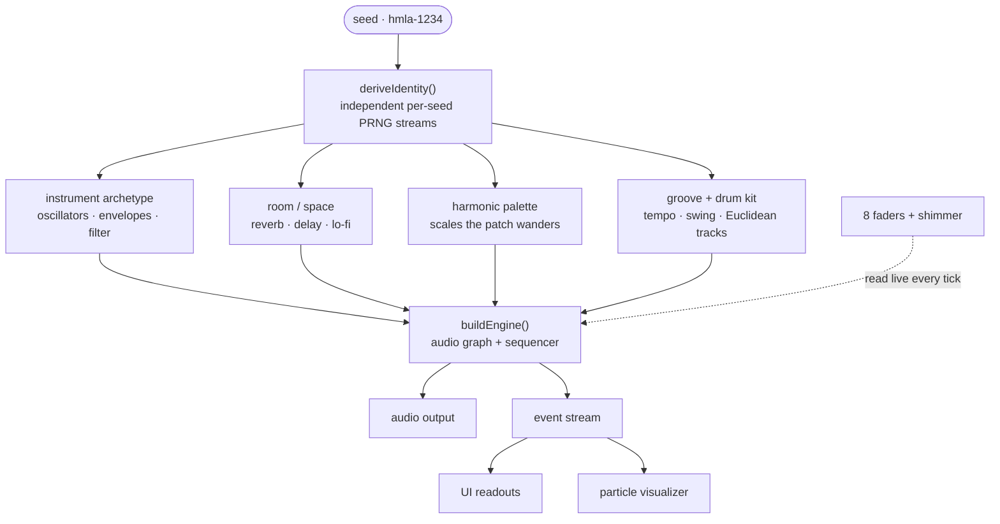

# hmla

**Generative ambient — seeded, ever-evolving.**

hmla is a browser instrument that synthesizes endless, slowly-evolving ambient
music entirely on the client (Web Audio via [Tone.js](https://tone.js.org/)) —
no samples, no audio files, everything you hear is generated live in your
browser. Every patch is derived from a short **seed**, so the same seed always
produces the same piece, and any patch is a shareable link.

🔊 **Live:** [hmla.richard.solar](https://hmla.richard.solar)

---

## What it does

- **Deterministic from a seed.** A seed (`hmla-1234`) maps to a fixed
  "instrument" — voice archetype, room/space, harmonic palette, groove and drum
  kit — so `same seed + same settings = same patch, every time`. Independent PRNG
  streams keep the melody, rhythm and timbre reproducible while sounding like a
  different machine from seed to seed.
- **Eight live faders.** `density · bright · space · chaos · grain · sub · pulse ·
lofi` (0–100) reshape the patch in real time without rebuilding the audio
  graph, plus a **shimmer** toggle (octave-up reverb halo). With **pulse** at
  zero it stays pure ambient; raise it to bring in the rhythm section.
- **Presets.** `calm`, `dense`, `puls`, `broken tape` as starting points.
- **Record.** Capture the output to a `.wav` download (with a WebM/M4A fallback
  where WAV isn't available).
- **Visualizer.** An event-driven particle canvas reacts to notes, grains,
  captures and drum hits.
- **Shareable patches.** Share to X / Bluesky / Facebook or copy a link. Shared
  links carry the exact patch and unfurl with a per-seed Open Graph card
  rendered on the edge.
- **Dark / light** themes, and a fully responsive "hardware unit" layout.

## How a patch is built

A shared link looks like `?s=hmla-1234` (the seed's preset) and gains
`&e=<encoded>` once you nudge a fader away from that preset (the exact mix).
Seeds are always `hmla-<digits>` — the digit suffix is the only editable part,
so a shared link or social card can never be crafted to render an arbitrary word.

## Tech stack

- **[Vite](https://vite.dev) 8** + **React 19** + **TypeScript** (type-checked
  with [tsgo](https://github.com/microsoft/typescript-go) /
  `@typescript/native-preview`)
- **[Tone.js](https://tone.js.org) 15** for all synthesis (Web Audio)
- **[pnpm](https://pnpm.io)** (via Corepack), with supply-chain hardening in
  `pnpm-workspace.yaml`
- **[oxlint](https://oxc.rs)** + **oxfmt** for linting/formatting, **husky** +
  **lint-staged** pre-commit
- **Vercel** edge functions ([`@vercel/og`](https://vercel.com/docs/og-image-generation))
  for OG images, edge middleware for crawler routing, and Vercel Web Analytics

## Development

Local setup, scripts, project structure and deployment notes live in
[DEVELOPMENT.md](DEVELOPMENT.md).
